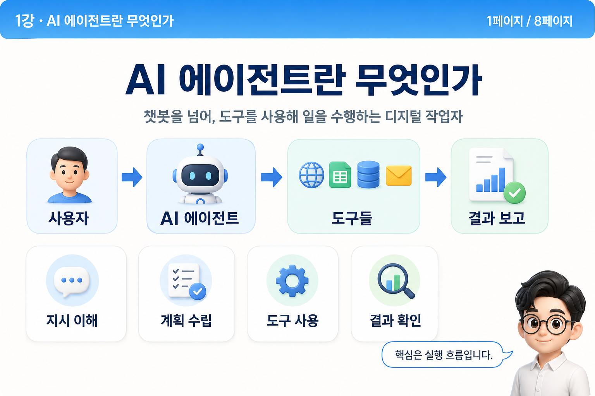
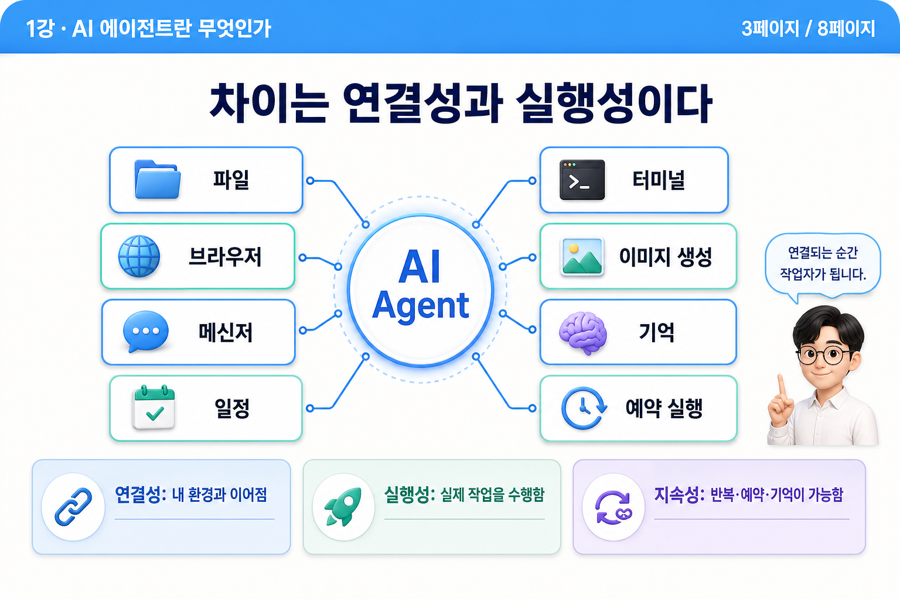
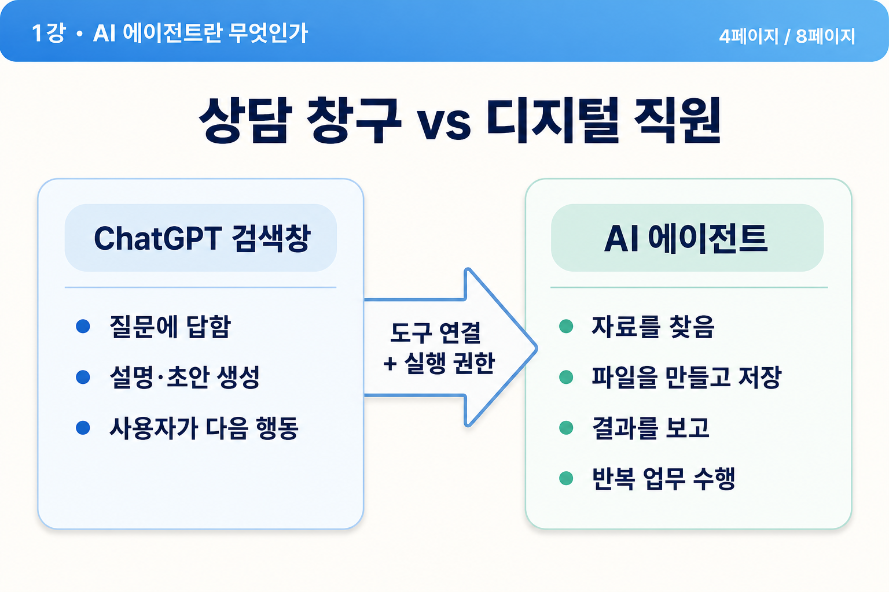
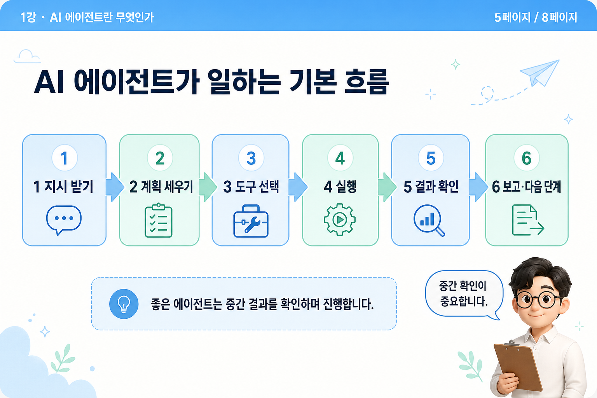
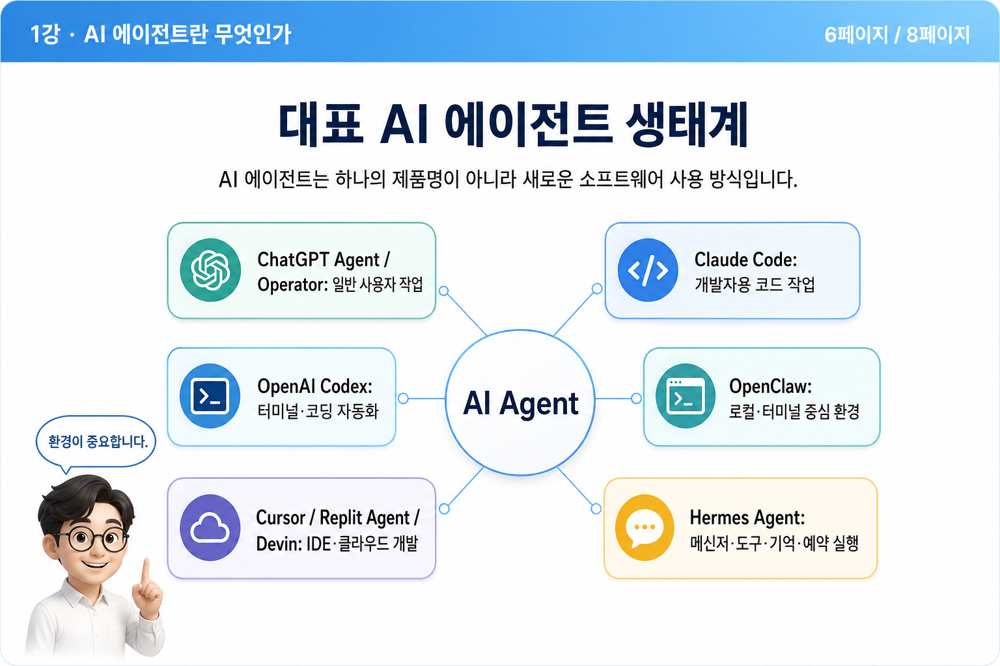
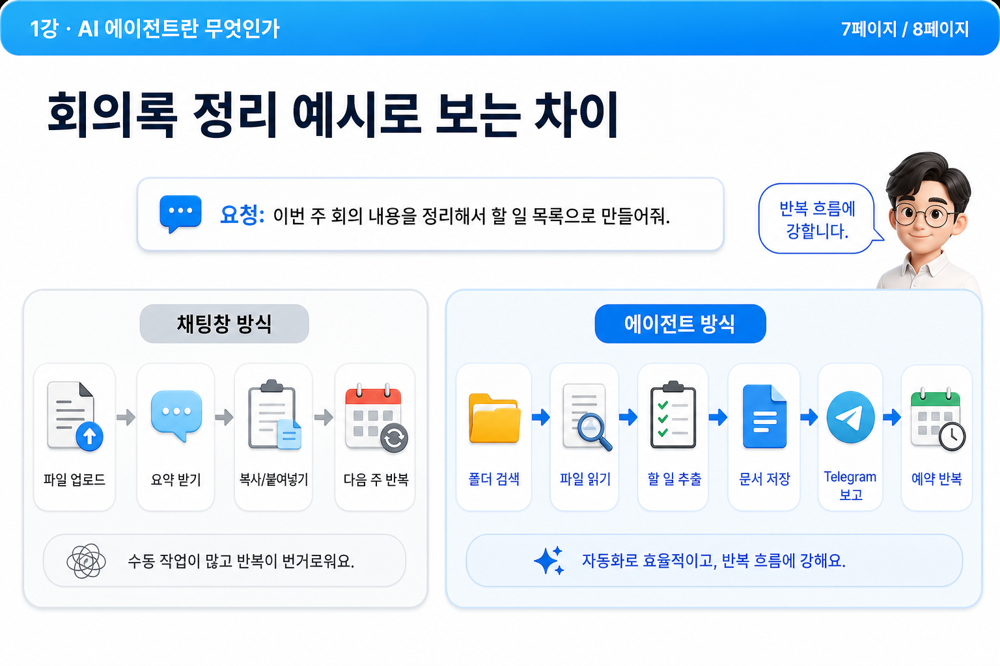
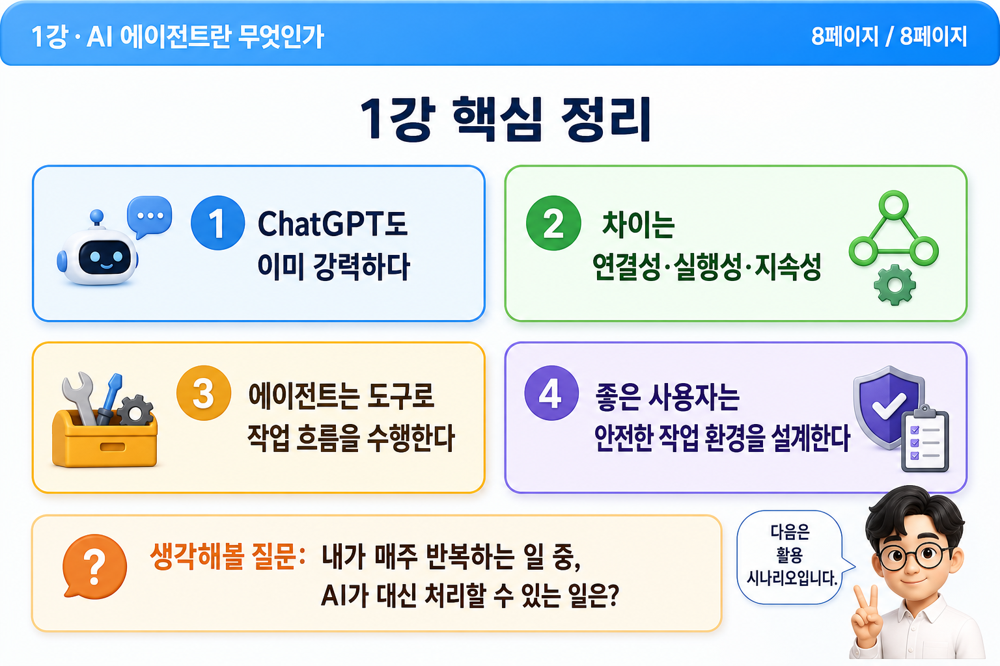

# 01강 - AI 에이전트란 무엇인가

## 발표 모드

- [전체화면 슬라이드쇼로 보기](슬라이드쇼?lecture=1)

## 강의 요약

AI 에이전트를 막연한 기술 용어가 아니라 내 일을 도와주는 디지털 작업자로 이해합니다.

## 최종 슬라이드

### 1페이지

### 2페이지

### 3페이지

### 4페이지

### 5페이지

### 6페이지

### 7페이지

### 8페이지

---

[[index|← 강의 목록으로 돌아가기]]
