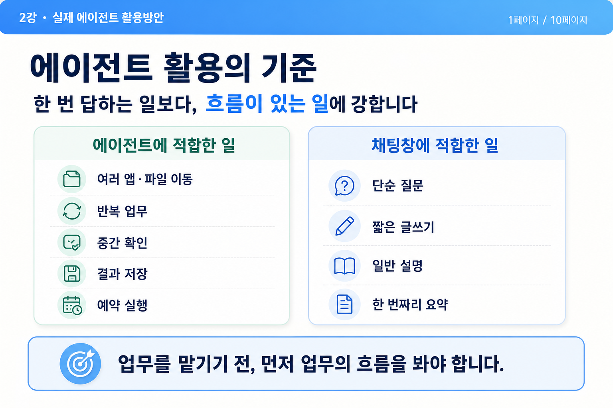
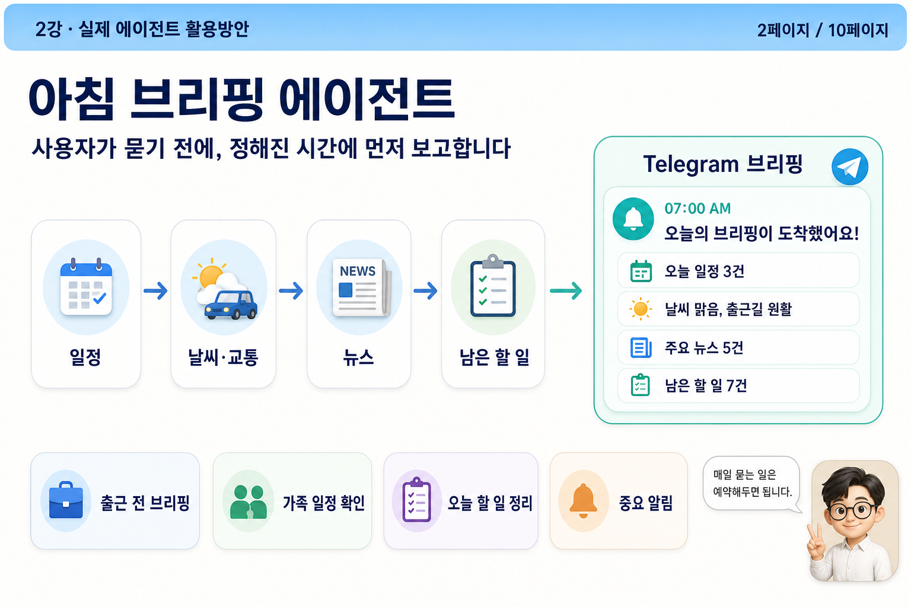
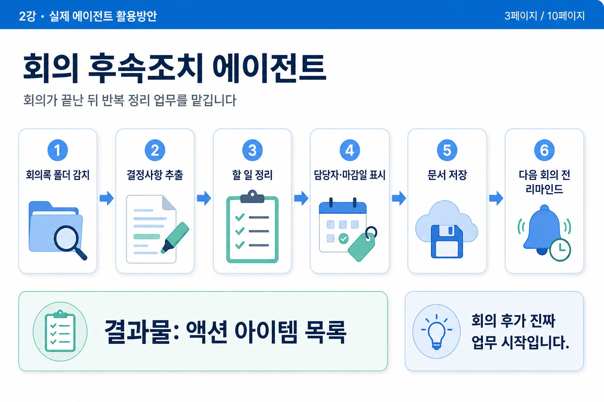
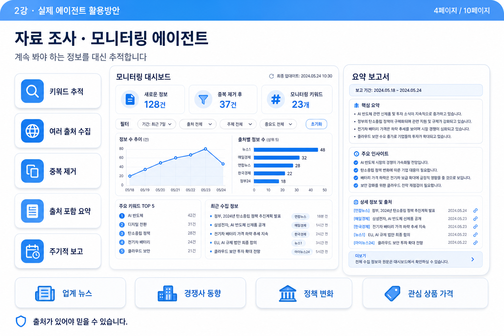
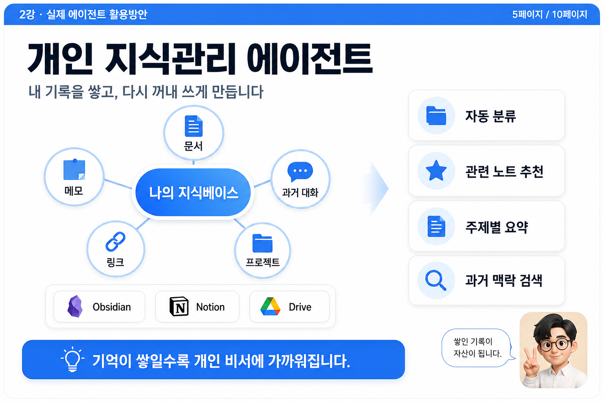
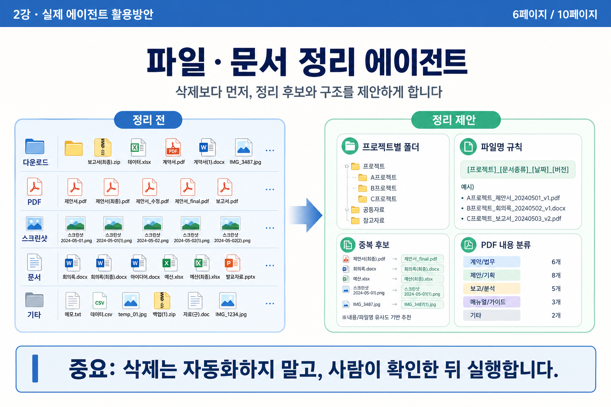
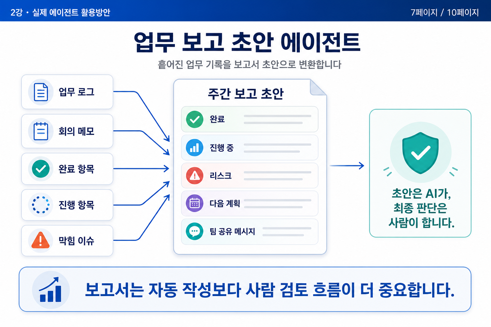
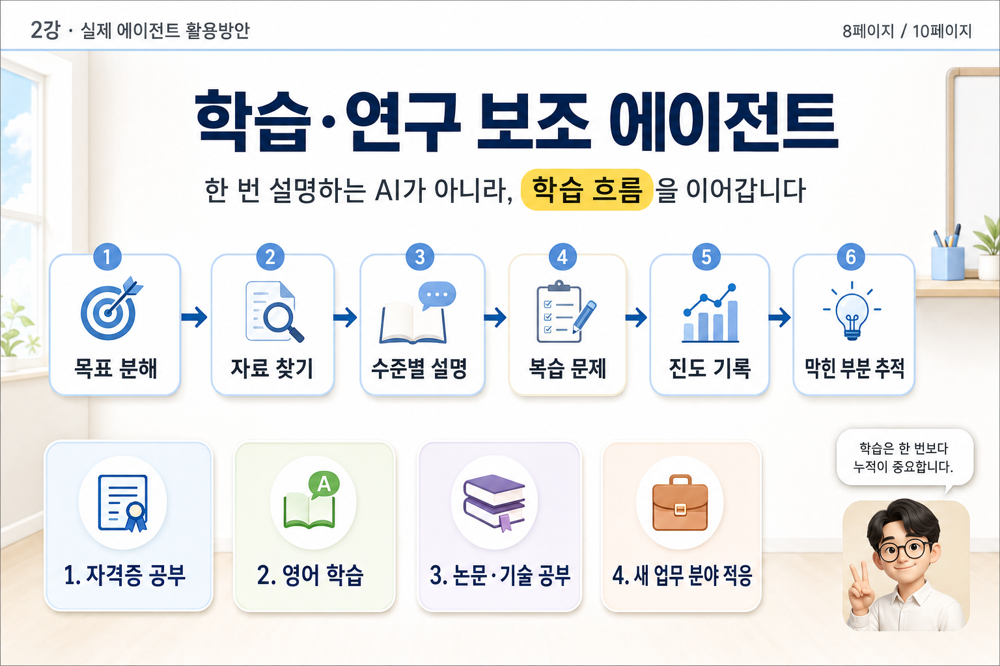
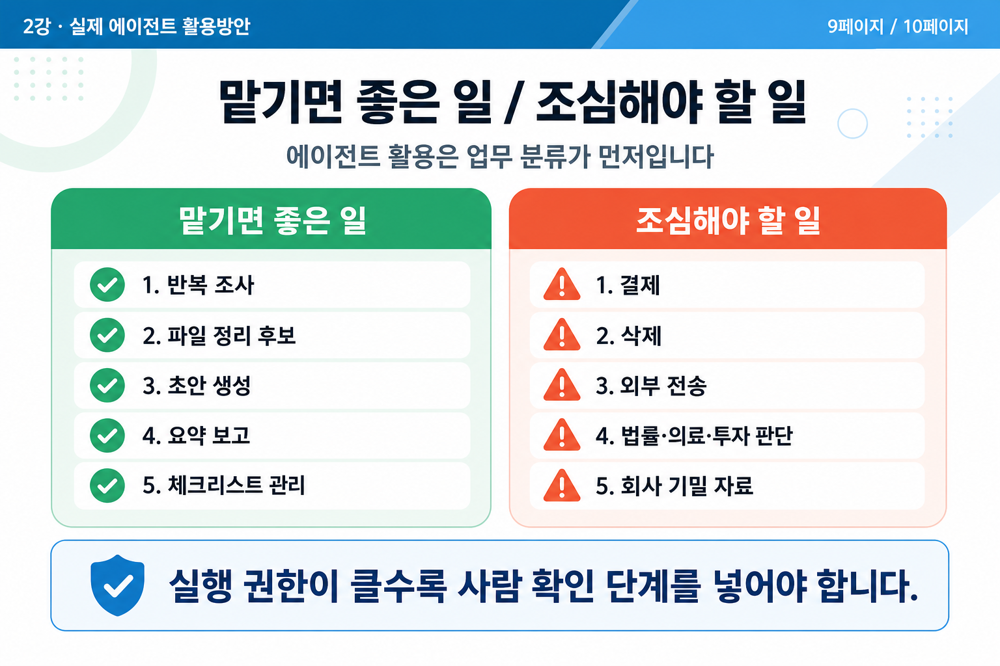
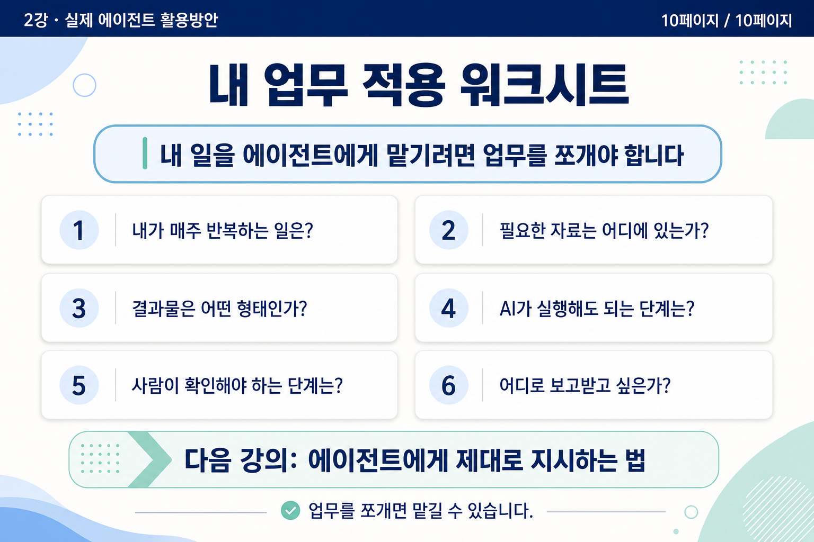

# 02강 - 실제 에이전트 활용방안

## 발표 모드

- [전체화면 슬라이드쇼로 보기](슬라이드쇼?lecture=2)

## 강의 요약

에이전트가 특히 강한 반복 업무, 조사, 보고, 지식관리 활용법을 살펴봅니다.

## 최종 슬라이드

### 1페이지

### 2페이지

### 3페이지

### 4페이지

### 5페이지

### 6페이지

### 7페이지

### 8페이지

### 9페이지

### 10페이지

---

[[index|← 강의 목록으로 돌아가기]]
