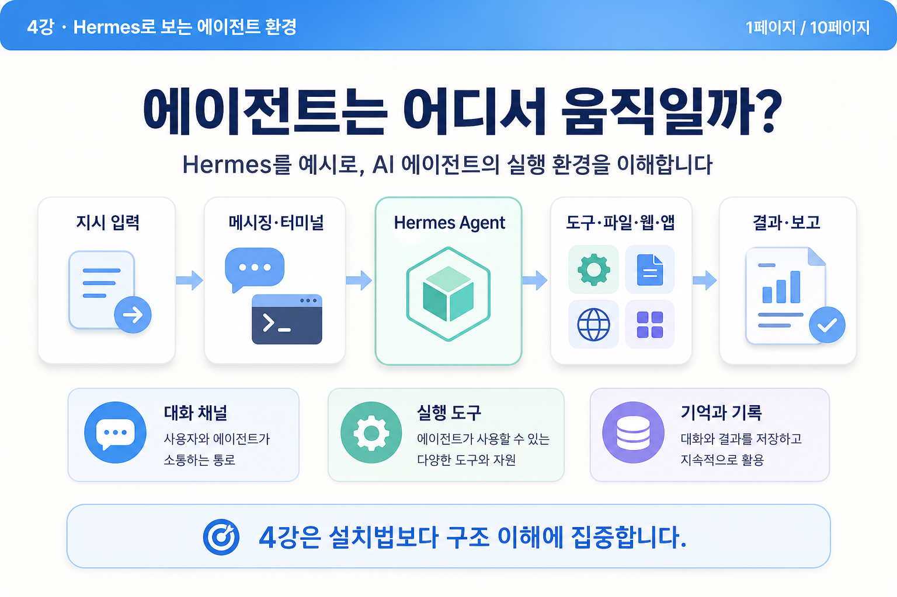
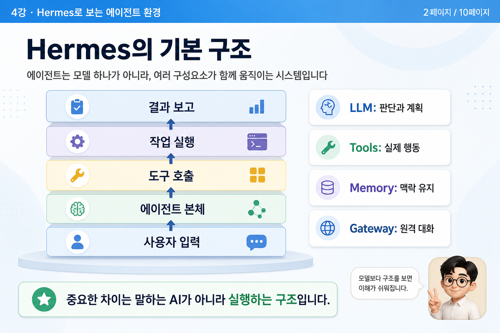
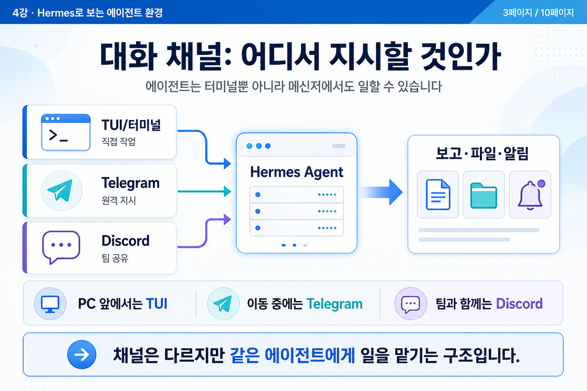
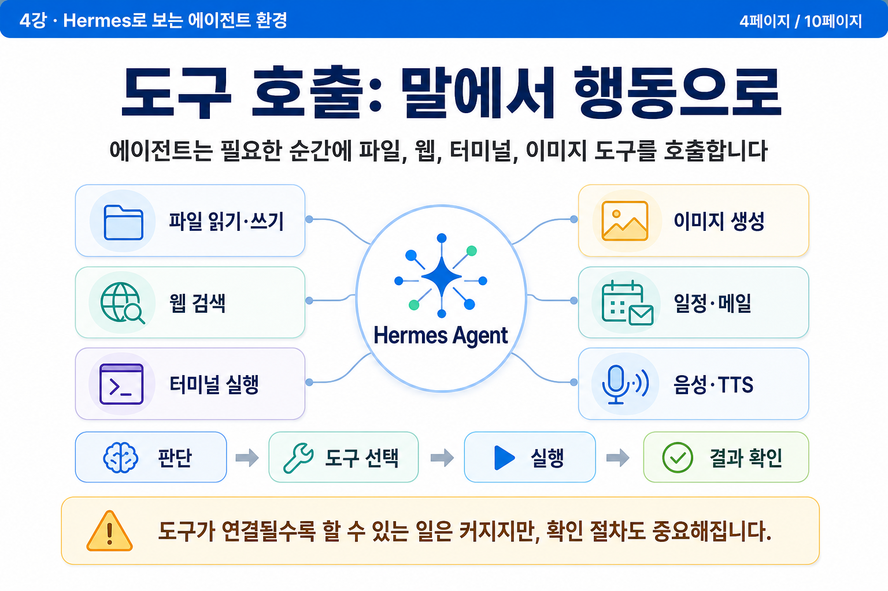
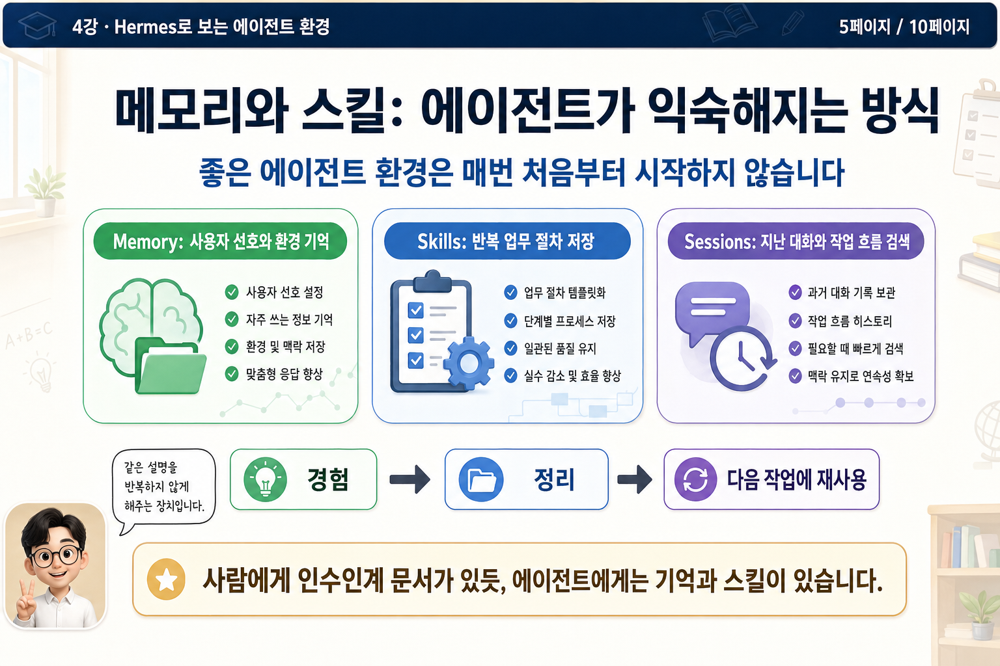
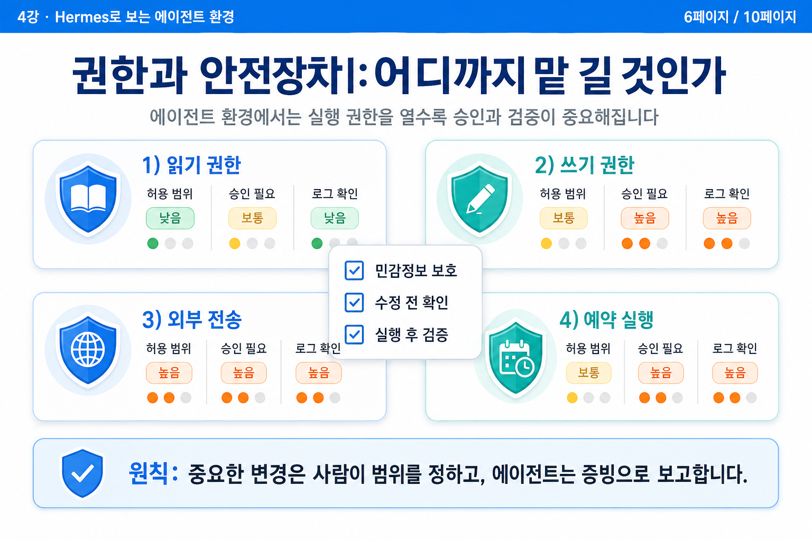
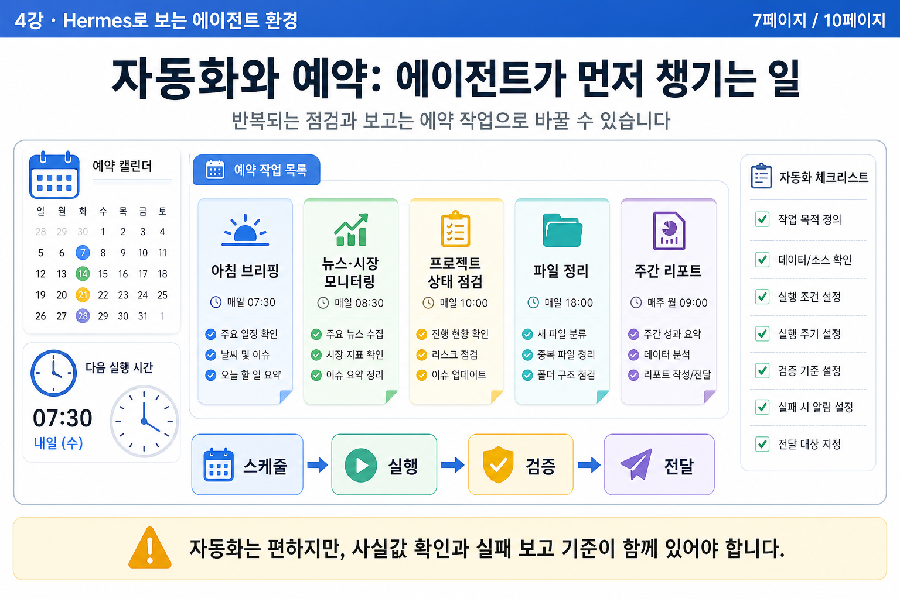
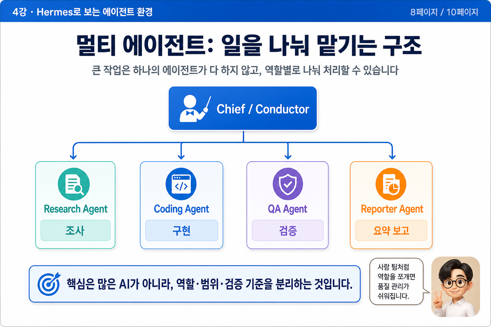
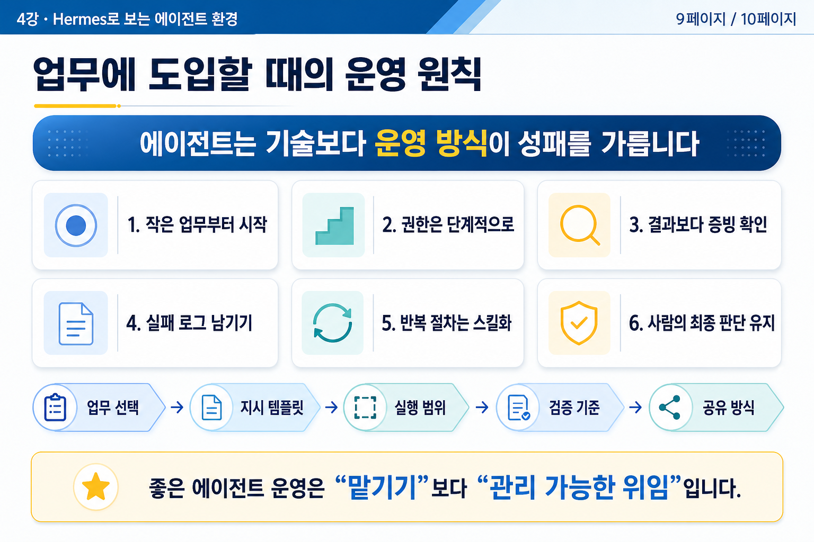
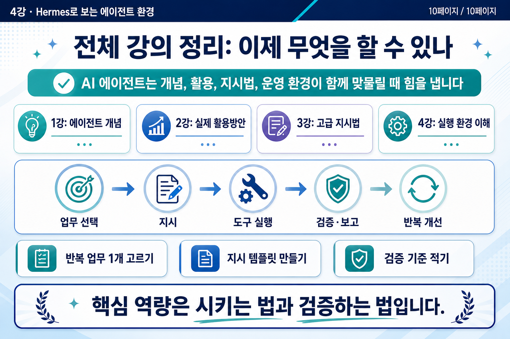

# 04강 - Hermes로 보는 에이전트 환경

## 발표 모드

<a href="https://namseokyoo.github.io/ai-agent-course/슬라이드쇼?lecture=4" class="course-primary-link">전체화면 슬라이드쇼로 보기</a>

## 강의 요약

Hermes를 예시로 에이전트 실행 환경의 구성요소와 운영 원칙을 이해합니다.

## 최종 슬라이드

### 1페이지

### 2페이지

### 3페이지

### 4페이지

### 5페이지

### 6페이지

### 7페이지

### 8페이지

### 9페이지

### 10페이지

---

[[index|← 강의 목록으로 돌아가기]]
